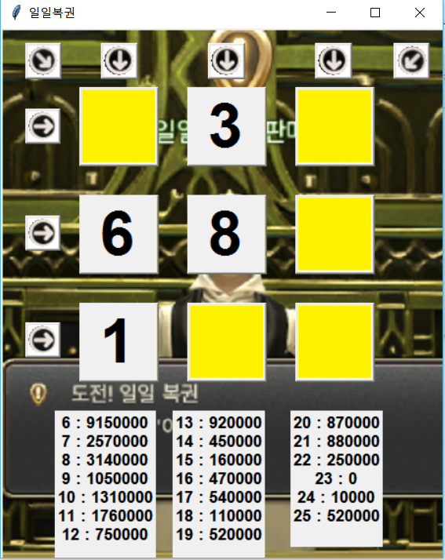
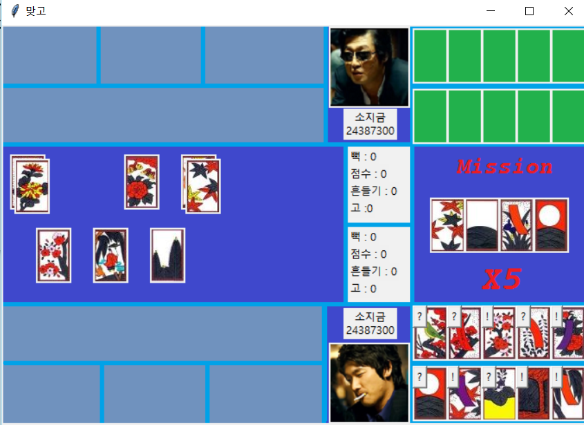
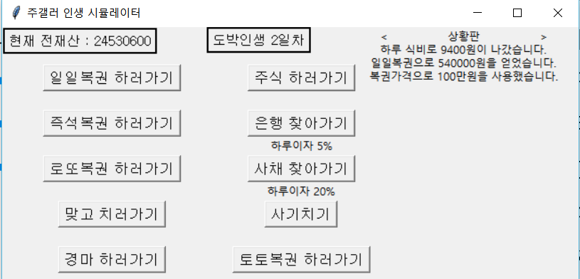

# Hello World-Hard
project by 24-team


## Project contributer
- Sang Won Kim
- 
- 

## Goal and Introduce of this project

'Hello World!' is a sentense that we meet necessarily when we start study about programming.
Our goal is to make several programs, which use basic principle, like sentense 'Hello World!'.
ex) simple games

Our project is using 'Python', and license is 'Apache License 2.0'.


### Apache License 2.0

This license means anybody can make a program derived from this software, and transfer copyright of this software.
Also, anybody can use software privately and commercially which followed 'Apache License 2.0'.

When you used software which followed 'Apache License 2.0' for development, or privately and commercially use, etc.,
you must specify in program clearly that 'This software follow 'Apache License 2.0', and developed by Apache Software Foundation.'.

If you want to know about this license detailedly, please click this link.
http://www.apache.org/licenses/LICENSE-2.0


## Commited program list

1. lottery.c
2. daylotto.py(Name is modified : lottery.py -> daylotto.py)
3. matgo.zip(matgo.py and many flies of 'matgo.py's class' are here.)
4. lottery_2.zip(New program)


## Manual of commited program

*lottery.c - uncompleted*
*Lottery.py*
*NOTICE : This program's name is modified -> daylotto.py*
```
This program is a daliy lottery program in 'Final Fantasy XIV'.
We make this program in Python.

1. Program will make 3*3 matrix, and will put natual number randomly(1~9). these numbers are not revealed. 
2. Program will open one space in matrix, and you can choose three space, which you want to know.
3. You should choose one row, or column.
4. Program will open all numbers, and sum three numbers you choosed.
5. You will get the amount that corresponds to the sum of the numbers.
```

*Matgo.py*
```
This program is a gamble program which called 'matgo' in Korea.
To play this game, you must follow some rules: 
```

*Lottery_2.py*
```
This program is gambler simulation program containing daylotto.py, Matgo.py, etc.
In this program, you will be a gambler who have a goal - Earn lot of money!

NOTICE for Korean user : This program's korean name is '주갤러 시뮬레이션'
```
## Screenshot

### Lottery.py

### Matgo.py

### Lottery_2.py

